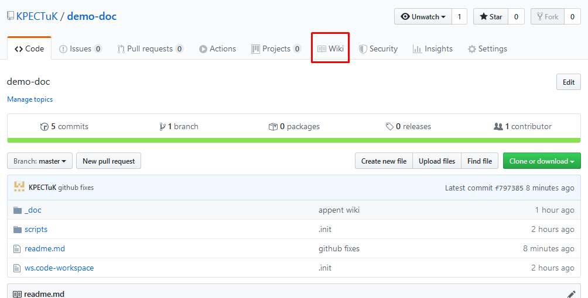
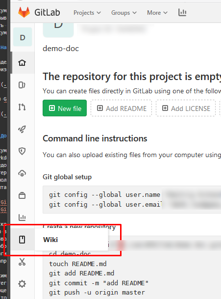

# Home

Документация в обоих сервисах хранится в отдельном репозитории и называется wiki и репозиторий wiki соответственно. В Web интерфейсах обоих есть соответствующий раздел и средства просмотра и редактирования документов.

## Навигация

Раздел документации озаглавлен как Wiki. Для GitHub он находится в горизонтальном меню репозитория.  

Для Gitlab это такое же меню, но с левой части рабочей области страницы.

## Документы

Документы могут быть оформлены как текстовые документы с разметкой формата markdown, конвертируемого в HTML, значительно более простого а следовательно доступного по сравнению с HTML вида. Существует несколько интерпретаторов markdown с незначительными различиями в виде дополнительных возможностей. В целом, можно ориентироваться на справки по синтаксису для любого из сервисов:

- [GitHub Markdown](https://guides.github.com/features/mastering-markdown/)
- [GitLab Markdown](https://docs.gitlab.com/ee/user/markdown.html)

Поскольку хранилище документации представляет из себя репозиторий git, в нем в качестве документов можно хранить файлы любого формата. Markdown позволяет ссылаться на ресурсы (на файлы из репозитория в том числе) для отображения их в документах wiki формата markdown. Возможно существуют плагины сервисов разработки, позволяющие отображать прочие форматы (например такие как документы OpenOffice)

Таким образом документация представляет из себя набор ресурсов wiki интегрированных в исходный код проекта, доступных для редактирования как в процессе редактирования проекта так и при помощи любых других инструментов, в том числе и Web редакторов интегрированных в сервисы разработки (в прочем, не уверен что эти редакторы удобны, я давно ими не пользовался - я не в курсе, но возможность есть)

Плюсы: 

- сосредоточена в одном месте
- позволяет наращивать и изменять содержание аналогично коду
- позволяет хранить и возможно отображать в броузере любые данные

Минусы:

- основной контекст редактирвания - сторонние редакторы (возможно устаревшая информация)
- форма хранения предполагает минимальные навыки обращения с git