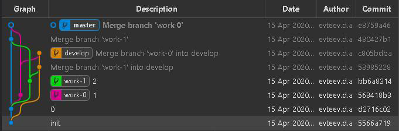

## Добрый день, коллеги.

Создана новая ветка для тестирования (пересоздание): __origin/AMS-RDX17.X-CTP__  
Ветка предназначена для распространения изменений по задачам среди разработчиков коллектива, для дальнейшего построения и публикации модуля на тест.

Просьба ко всем разработчикам, задачи которых находятся в состоянии согласования с аналитиками (код задач которых присутствует в тестировании) слить свою рабочую ветку в указанную выше, для обеспечения продолжения тестирования.

## Обоснование метода колаборации в процессе разработки кода

Хотелось бы проинформировать Вас о том, что создана новая ветка для тестирования. Ветка отражает состояние модуля версии CTP и включает все задачи в той или иной степени готовности, разрабатываемые коллективом и готовые к тестированию аналитиками. Наличие общей ветки тестирования необходимо, поскольку имеется только один тестовый репозиторий приложения, а следовательно только одна тестовая версия, по этому нет возможности тестировать каждую задачу отдельно в окружении копии релиза. Так же невозможно полностью полагаться на конструкцию приложения, поскольку с одним и тем же плагином в одно и тоже время работают более чем один разработчик. Отмечу так же, что модуль для тестирования компилируется и публикуется каждым разработчиком индивидуально, по этому нужен исходный код, учитывающий прогресс задач всего коллектива, по готовности к публикации каждого конкретного разработчика.

В связи в вышеизложенным предлагаю следующий протокол проектирования и публикации задачи.  
В процессе участвуют несколько веток:

- __(origin/)AMS-RDX17.X__
  - (master) ветка, отражающая состояние модуля на бою
  - существует и в локальном и удаленном репозитории
  - защищенная
- __(origin/)AMS-RDX17.X-CTP__
  - (develop/test) ветка, отражающая состояние модуля для тестирования
  - существует и в локальном и удаленном репозитории
  - защищенная
- __work__
  - (рабочая) ветка, для проектирования кода задачи
  - существует локально, может быть залита в удаленный репозиторий для обсуждения, после чего должна быть удалена из удаленного репозитория
  - может иметь любое название, удобное исполнителю

Процесс подчиняется следующим правилам:

1. После постановки задачи, __из master__ должна быть __создана новая рабочая ветка__ для выполнения задачи - изменения производятся в ней
2. Для __демонстрации результата__ необходимо сделать __слияние из рабочей ветки в ветку develop и опубликовать модуль__, построенный из ветки develop, __на тест__
3. Для для __публикации релиза__ задачи необходимо сделать __слияние из рабочей ветки в ветку master и опубликовать модуль__, построенный из ветки master, __на бой__

В упрощенном виде граф репозитория выглядит так:  

На изображении:

- синим - обозначена ветка master
- оранжевым - обозначена ветка develop
- зеленый и розовый - рабочие ветки
- изображено слияние рабочих веток в master и develop

В качестве инструмента редактирования локального репозитория, наряду с плагином VisualStudio, рекомендую использовать __командную строку и VSCode с плагинами GitLense и GitGraph__. Лучшего инструмента по скорости работы наглядности и удобству мне не известно. Однако не рекомендую пользоваться большинством команд плагина Visual Studio т.к. терминология и операции не всегда соответствую принятым в git. Плагин по команде может совершать последовательность операций, которая не всегда очевидна и одинакова. Это уменьшает степень контроля над кодом и приводит к путанице.

По названиям веток, есть соглашение, но оно имеет значение только в случае необходимости загрузки ветки в удаленный репозиторий.

Защищенные ветки обычно защищены от каких либо действий со стороны пользователей не обладающих правами. Например: в master запрещено загружать изменения в удаленный репозиторий, и master и develop запрещено удалять - всем кроме руководителей проекта, не уверен что у нас такие есть.

Можно пользоваться несколькими локальными ветками помимо рабочей по задаче, например для разработки общего элемента управления. Для всех для них должны соблюдаться эти же правила.

Для того чтобы граф изменений было проще читать, рекомендую использовать _rebase_ ваших НЕ загруженных в удаленный репозиторий комитов, в случае синхронизации рабочей ветки с master, если эта синхронизация необходима. Существует так же опция _commit --amend_ и команда _cherry-pick_ которые тоже могут оказаться полезными. Чем менее разветвленно дерево изменений, тем проще и удобнее с ним работать.

__Никогда не производите слияние ветки develop в рабочую.__ Во время слияния, дополнительных манипуляций с файлами, которые Вы НЕ редактировали в процессе проектирования, производить НЕ нежно. Это касается практически всех ситуаций за исключением сложных слияний со старыми ветками в которых возможно большое количество конфликтов из-за большого расхождения версий.

Настоятельно рекомендую придерживаться данного сценария, это сделает жизнь проще (должно по крайней мере). Если есть дополнения на эту тему, с удовольствием выслушаю.
